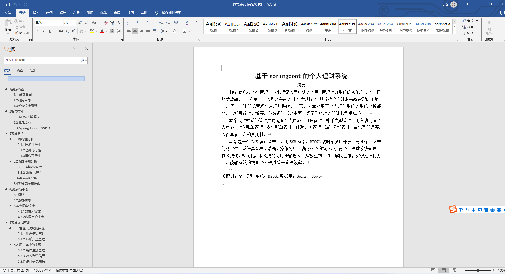
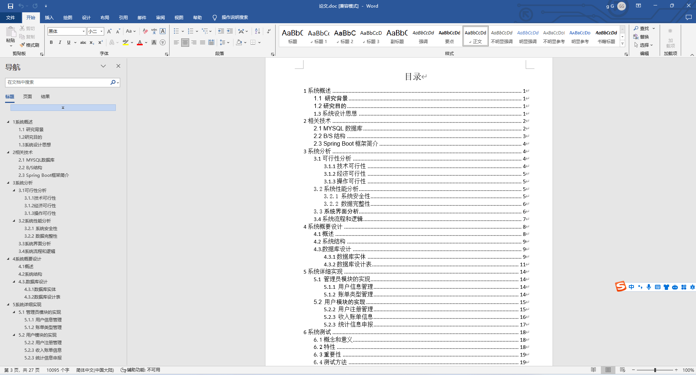
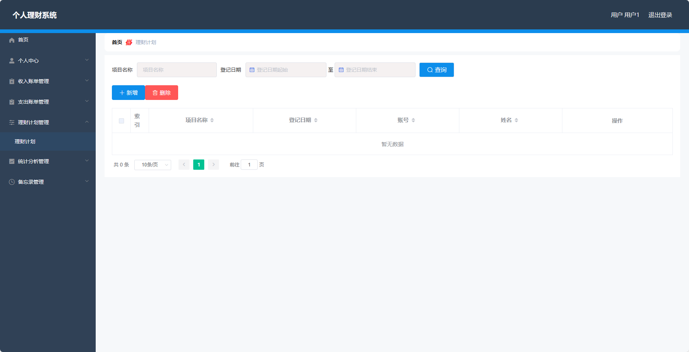
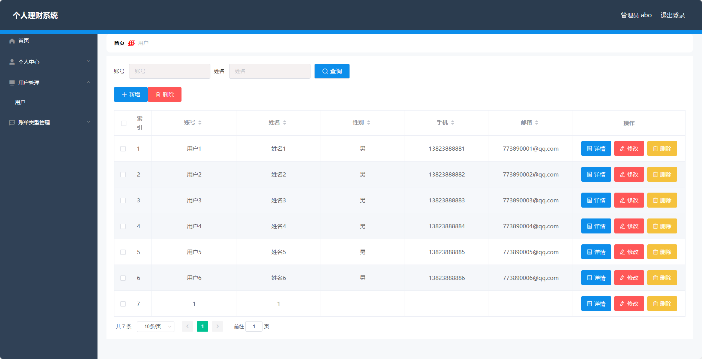
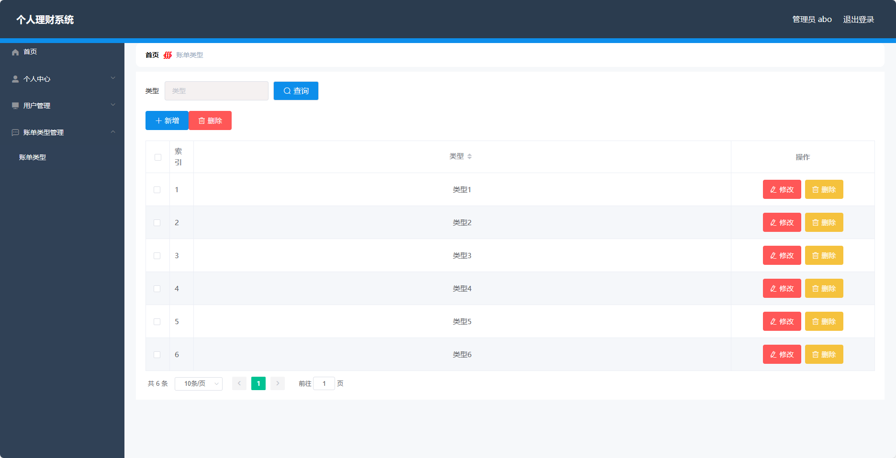

基于SpringBoot的个人理财系统（程序+论文）
=
- 完整代码获取地址：从戎源码网 ([https://armycodes.com/](https://armycodes.com/))
- 作者微信：19941326836  QQ：952045282 
- 承接计算机毕业设计、Java毕业设计、Python毕业设计、深度学习、机器学习
- 选题+开题报告+任务书+程序定制+安装调试+论文+答辩ppt 一条龙服务
- 所有选题地址https://github.com/nature924/allProject

一、项目介绍
---
基于Spring Boot框架实现的个人理财系统，系统包含两种角色：管理员、用户,系统分为前台和后台两大模块，主要功能如下。

### 【管理员】：
个人中心：管理员可以在个人中心查看和修改自己的个人信息。
用户管理：管理员可以对用户进行管理，包括添加新用户、编辑用户信息、删除用户以及查看用户列表。
账单类型管理：管理员可以管理账单类型，包括添加新的账单类型、编辑账单类型信息、删除账单类型以及查看账单类型列表。

### 【用户】：
个人中心：用户可以在个人中心查看和修改自己的个人信息。
收入账单管理：用户可以添加和管理收入账单，包括记录收入的金额、时间、来源等信息，查看、编辑和删除已记录的收入账单。
支出账单管理：用户可以添加和管理支出账单，包括记录支出的金额、时间、用途等信息，查看、编辑和删除已记录的支出账单。
理财计划管理：用户可以制定和管理理财计划，包括设定目标、计划时间、计划金额等信息，查看、编辑和删除已设定的理财计划。
统计分析管理：用户可以查看自己的收入和支出情况的统计分析结果。
备忘录管理：用户可以添加、编辑和删除备忘录。

二、项目技术
---
- 编程语言：Java
- 数据库：MySQL
- 项目管理工具：Maven
- 前端技术：VUE、HTML、Jquery、Bootstrap
- 后端技术：Spring、SpringMVC、MyBatis

三、运行环境
---
- 操作系统：Windows、macOS都可以
- JDK版本：JDK1.8以上都可以
- 开发工具：IDEA、Ecplise、Myecplise都可以
- 数据库: MySQL5.7以上都可以
- Tomcat：任意版本都可以
- Maven：任意版本都可以

四、运行截图
---
### 论文截图：

### 程序截图：

